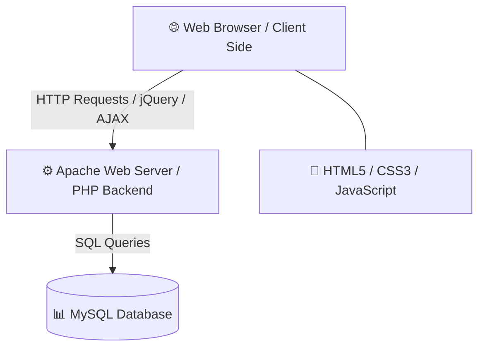

# 🎓 Student Management System (SMS)

A dynamic, web-based platform designed to centralize and automate institutional workflows. The system bridges the gap between administrators, faculty, and students by digitizing student directories, academic performance scoring, and daily attendance logs. 

---

## 🛠️ Tech Stack & Architecture



### 💻 Client-Side (Frontend)
*   **HTML5 & CSS3** – Responsive user interfaces tailored for mobile, tablet, and desktop monitors.
*   **JavaScript & jQuery** – Dynamic DOM manipulation, seamless menu toggles, and interactive field verification.
*   **html2canvas** – Client-side script enabling users to screenshot and export their web marksheets as local image files.

### 🎛️ Server-Side (Backend & Database)
*   **PHP (v7.4+)** – Server-side controller scripting for input processing, route handling, and authentication.
*   **Apache** – Secure HTTP application hosting environment.
*   **MySQL Database** – Relational engine used to store persistent credentials, personal data arrays, and performance tables.

---

## 🚀 Key Modules & System Workflow

### 🗺️ Multi-Institution Landing Portal (`Select Page`)
*   **Direct Entryway** – Acts as the centralized index listing all registered sister campuses or institutions.
*   **Profile Cards** – Highlights individual organization labels, branding logos, and short descriptions to route users to the correct institutional hub.

### 🏛️ Campus Hub (`Homepage`)
*   **Visual Gallery** – Displays campus infrastructure imagery alongside core institutional vision, mission statements, and structural details.
*   **Sidebar Navigation** – Features an accessible collapsible side-menu configured to guide different user roles into their dedicated workspaces.

### 🧑‍🎓 Student Portal (`Student View`)
*   **Protected Access** – Restricts entrance to active students verifying through their unique Pin Numbers and credentials.
*   **Read-Only Dashboard** – Grants a clean summary grid displaying non-editable personal details, branch listings, registration timestamps, and email contacts.

### 🛠️ Administrative Control Center (`Admin View`)
*   **Tabular Database UI** – Organizes the full collective student registry into structured column lists with inline modification toggles.
*   **Search Engine** – Offers live text filtering to sort rosters dynamically by Student IDs, legal names, or course disciplines.
*   **Full CRUD Suite** – Equips operators with secure forms to onboard new profiles, update student fields, or clear records.

### 📊 Academic Grading Matrix (`Marks Module`)
*   **Dynamic Entry Controls** – Allows backend grade allocation mapped directly to specific branches, current semesters, and evaluation types (Internal continuous diagnostics vs. External terminal finals).
*   **Score Bounds** – Implements client-side rules and database triggers constraining input figures exclusively between `0` and `80`.
*   **Report Card Generator** – Tallies cumulative grades, compiles percentage averages, and outputs contextual `Pass`/`Fail` benchmarks.
*   **PNG Exporter** – Triggers an instant download of the complete visual marks table for offline student record-keeping.

### 📅 Logbook Tracker (`Attendance Module`)
*   **Dynamic Roster Check** – Authorized staff pick discrete dates and classrooms to tick through active student lists.
*   **Multi-State Indicators** – Supports clear radio selectors tagging status markers: `Present`, `Absent`, `Late`, or `Excused Absence`.
*   **Metrics Reporting** – Renders analytics summaries tracking individual aggregate attendance metrics alongside teacher notes.

---

## 🖥️ System Requirements

*   **Processor:** Minimum Dual-Core (Client) / Quad-Core Intel i5 or matching grade (Server).
*   **Memory:** Minimum 4 GB RAM (Client) / 8 GB baseline, 16 GB recommended (Server).
*   **Storage Space:** 50 GB local disk space (Client) / 256 GB fast SSD space alongside a secondary backup drive (Server).
*   **Browsers Supported:** Google Chrome, Mozilla Firefox, or Apple Safari (latest stable iterations).

---

## 📦 Local Installation Guide

1.  **Clone the Repository**
    ```bash
    git clone https://github.com
    ```

2.  **Deploy on Web Server**
    *   Move the source root directory folder to your local server setup environment (e.g., `htdocs` under your XAMPP installation, or path `/var/www/html/` for standard Linux Apache servers).

3.  **Set Up the Relational Schema**
    *   Access your local database administrative control dashboard (such as `phpMyAdmin`).
    *   Initialize a clean structural workspace database target engine labeled `student_management_system`.
    *   Locate the matching configuration initialization file within your directories and run the data import.

4.  **Configure Environment Controls**
    *   Edit your internal database path connection hooks (`config.php` or your core server connection endpoints) to update matching attributes like localhost names, administrative system credentials, and active passwords.

5.  **Run the Live System**
    *   Fire up your targeted system web browser and key in the primary entrance routing layout:
    ```text
    http://localhost/student-management-system/SelectPage.html
    ```
